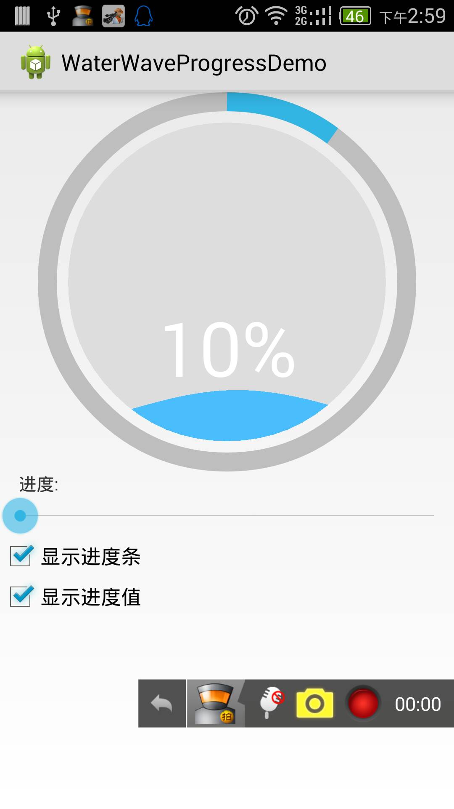
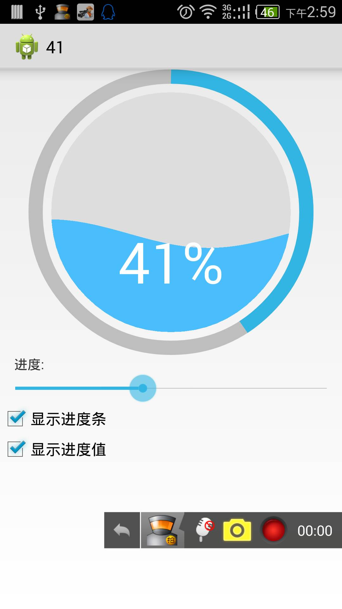
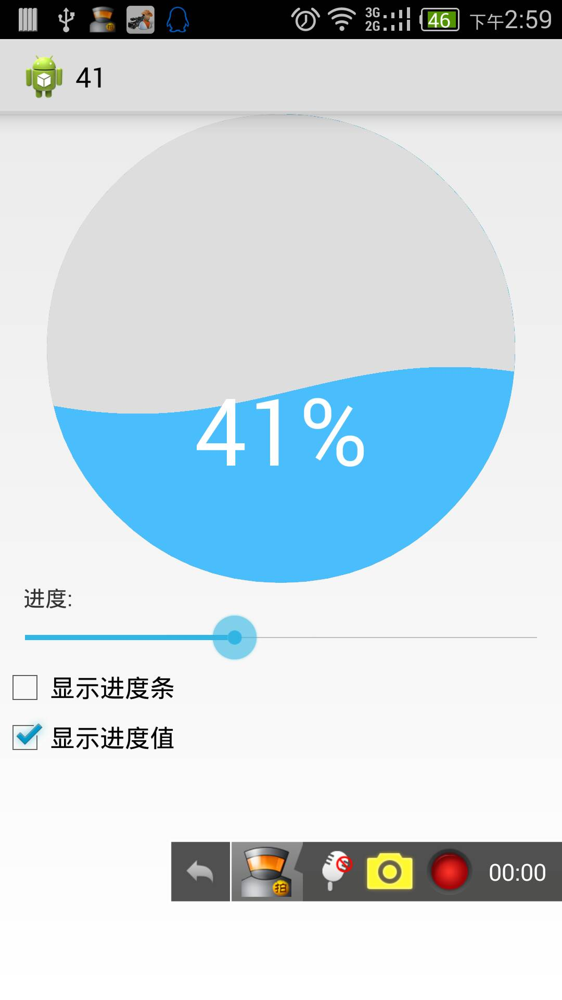
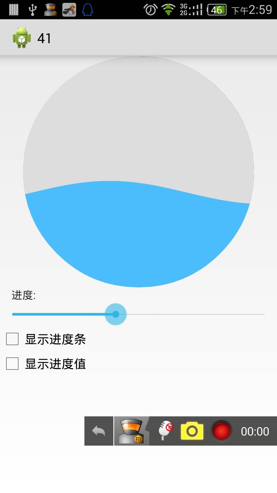
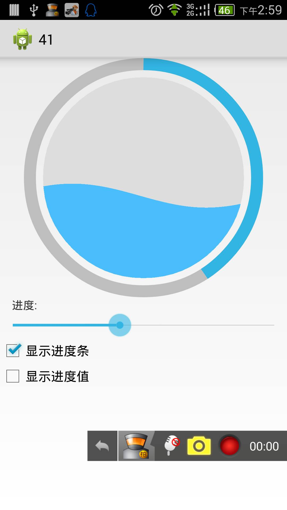

water-wave-progress
===================

水波按进度上升，带环形进度条
理论上是可以在2.3及以下的版本上使用的(没做成控件之前确实如此,但是现在死活不显示,又不报错,不知道什么原因)

so,限制4.0以上  让2.3见鬼去吧,,还有4.1.1 水波是方的,官方不支持我也没办法,如果用图片画的话效率,速度会差很多


见名知义吧,很简单的,全都是非必填,,布尔值默认为true
```xml
<?xml version="1.0" encoding="utf-8"?>
<resources>

    <declare-styleable name="WaterWaveProgress">
        <attr name="progressWidth" format="dimension" />
        <attr name="fontSize" format="dimension" />
        <attr name="progressColor" format="color" />
        <attr name="progressBgColor" format="color" />
        <attr name="waterWaveColor" format="color" />
        <attr name="waterWaveBgColor" format="color" />
        <attr name="progress2WaterWidth" format="dimension"/>
        <attr name="showProgress" format="boolean"/>
        <attr name="showNumerical" format="boolean"/>
        <attr name="textColor" format="color" />
        <attr name="progress" format="integer" />
        <attr name="maxProgress" format="integer" />
    </declare-styleable>

</resources>
```

注释写得很全,再看不懂就不关我的事了 :)

CSDN:http://blog.csdn.net/modificator  很久没写了

个站:www.modificator.cn  在建中,别吐槽

邮箱: yunshangcn@gmail.com & yunshangcn@qq.com 欢迎交流


多图

<div style="width:600px">



</div>


